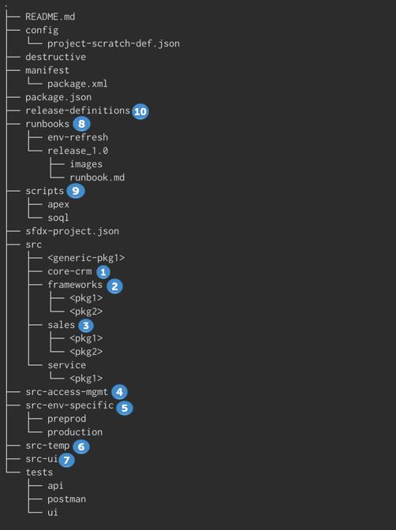

# Repository Structure

DX@Scale projects predominantly follow a multiple mono-repo structure similar to the picture shown above. Each repository has a "**src"** folder that holds one or more packages that map to your **sfdx-project.json** file.

Different folders in each of the structure are explained as below

1. **core-crm:**  A folder to house all the core model of your org which is shared with all other domains.
2. **frameworks:** This folder houses multiple packages which are basically utilities/technical frameworks such as Triggers, Logging and Error Handling, Dependency Injection etc.
3. **sales:** An example of a domain in your org. Under this particular domain, multiple packages that belong to the domain are included. Domains can map to the Salesforce Products but it is up to you to define.
4. **src-access-mgmt:**  This package is typically one of the packages that is deployed second to last in the deployment order and used to store profiles, permission sets, and permission set groups that are applied across the org.
5. **src-env-specific:** An aliasified packaged which carries metadata for each particular stage \(environment\) of your path to production.  Some examples include named credentials, remote site settings, web links, custom metadata, custom settings, etc
6. **src-temp:** This folder is marked as the default folder in sfdx-project.json. This is the landing folder for all metadata and this particular folder doesn't get deployed anywhere other than a developers scratch org. This place is utilized to decide where the new metadata should be placed into.
7. **src-ui:** ould include page layouts, flexipages and Lightning/Classic apps unless we are sure these will only reference the components of a single domain package and its dependencies. In general custom UI components such as LWC, Aura and Visualforce should be included in a relevant domain package.
8. **runbooks:** This folder stores markdown files required for each release and or sandbox refresh to ensure all manual steps are accounted for and versioned control.  As releases are completed to production, each release run book can be archived as the manual steps should typically no longer be required.  Sandbox refresh run books should be managed accordingly to the type of sandbox depending if they have data or only contain metadata.
9. **scripts:** This optional folder is to store commonly used apex or soql scripts that need to be version controlled and reference by multiple team members.  
10. **release-definitions:** This folder stores the release definition YAML files mapped to the **sfpowerscripts:orchestrator:release** path definition switch.  


src-env-specific should be added to .forceignore files and should not be deployed to a scratch org.


This will form your initial structure of packaging. Once some development cycles are being completed, frameworks can be moved into its own repository. If you also figure a particular domain is being not iterated upon frequently anymore and there are no upward dependency, they could also be removed into another repository.

